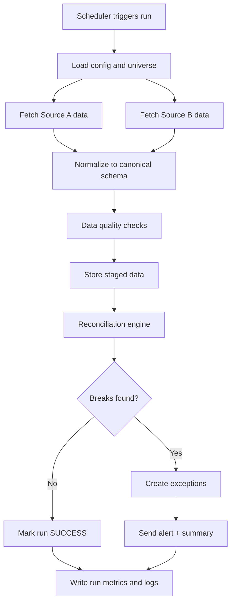

# Automated Financial Reconciliation Engine - Workflow Design

## 1) Goal (Trade Ops Lens)
Build a **daily control pipeline** that:
- ingests market and derivatives data from multiple sources,
- standardizes and stores it,
- reconciles key fields across sources,
- opens exceptions for breaks,
- alerts operator only when action is needed,
- keeps an audit trail for review.

---

## 2) End-to-End Workflow (Simple)

---

## 3) Daily Run Phases

### Phase A - Pre-Run Controls
- Validate environment variables and API credentials.
- Check data source connectivity.
- Create `run_id` and start timestamp.
- Load the instrument universe:
  - **Equities**: ticker list (e.g., AAPL, MSFT, SPY).
  - **Options**: underlyings to expand into chains (e.g., SPY), optionally filtered to near-the-money strikes and the front few expiries to keep volume manageable.
  - **Futures**: continuous-contract symbols (e.g., ES=F, CL=F, GC=F).
  - **Swaps / Forwards (OTC)**: the trade blotter exported from the internal booking system (there is no listed universe to fetch).

### Phase B - Ingestion
- Pull the same instruments from Source A and Source B.
  - **Equities**: daily OHLCV bars per ticker.
  - **Options**: the chain per underlying (calls + puts), capturing each contract's `close`, `bid`, `ask`, `volume`, and `open_interest`.
  - **Futures**: OHLCV bars per continuous contract (yfinance; Alpaca has no free futures feed).
  - **Swaps / Forwards (OTC)**: load the internal blotter (Source A) and mark each trade against a free market reference (Source B) — yield proxies for swaps, live FX spot + covered-interest-parity for forwards.
- Save raw payload snapshots for traceability.
- Capture request metadata (provider, latency, status).

### Phase C - Standardization
- Convert both feeds to canonical schemas:
  - **Equities**: (`symbol`, `date`, `open`, `high`, `low`, `close`, `volume`).
  - **Derivatives**: (`underlying`, `expiry`, `strike`, `option_type`, `date`, `close`, `bid`, `ask`, `volume`, `open_interest`). The OPRA contract symbol (e.g., `SPY241220C00500000`) is parsed into these fields so the two vendors align on a common key.
- Normalize types/timezones; deduplicate rows.
- Reject malformed rows into quarantine table.

### Phase D - Reconciliation (Core Ops Control)
- Join Source A and Source B by the instrument key:
  - **Equities**: (`symbol`, `date`).
  - **Derivatives**: (`underlying`, `expiry`, `strike`, `option_type`, `date`).
- Compute deltas, e.g. `abs(close_a - close_b) / close_b`. For thinly traded contracts where the last trade is stale, fall back to the bid/ask midpoint before comparing.
- Apply thresholds:
  - **Critical**: > 0.50%
  - **Warning**: > 0.10% and <= 0.50%
  - *(Options tolerances may be set wider than equities, since contract prices are lower and noisier.)*
- Mark each item as `PASS`, `WARN`, or `BREAK`.

### Phase E - Exception Management
- For `BREAK` rows, insert exception records.
- Include owner, status, created_at, reason_code, notes.
- Status lifecycle: `OPEN -> INVESTIGATING -> RESOLVED`.

### Phase F - Alerting + Reporting
- Send notification only on WARN/BREAK or pipeline failure.
- Include run summary:
  - instruments checked
  - pass/warn/break counts
  - top 5 largest breaks
- Write final run metrics and end status.

---

## 4) Suggested Data Model (Minimal)

### `pipeline_runs`
- `run_id` (PK)
- `start_ts`, `end_ts`
- `status` (`SUCCESS`, `FAILED`, `SUCCESS_WITH_BREAKS`)
- `records_ingested_a`, `records_ingested_b`
- `pass_count`, `warn_count`, `break_count`
- `error_message`

### `market_data_staging` (equities)
- `run_id`
- `source` (`A`, `B`)
- `symbol`, `trade_date`
- `open`, `high`, `low`, `close`, `volume`
- `ingested_ts`

### `options_data_staging` (derivatives)
- `run_id`
- `source` (`A`, `B`)
- `underlying`, `expiry`, `strike`, `option_type` (`C`, `P`)
- `contract_symbol` (OPRA, e.g., `SPY241220C00500000`)
- `trade_date`
- `close`, `bid`, `ask`, `volume`, `open_interest`
- `ingested_ts`

### `futures_data_staging` (derivatives — listed)
- `run_id`
- `source` (`A`, `B`)
- `symbol` (continuous-future symbol, e.g. `ES=F`)
- `trade_date`
- `open`, `high`, `low`, `close`, `volume`
- `ingested_ts`

### `swaps_data_staging` (derivatives — OTC)
- `run_id`
- `source` (`A` = internal book, `B` = market reference)
- `trade_id`, `counterparty`, `currency`, `notional`
- `pay_receive`, `fixed_rate_pct`, `floating_index`, `pay_freq`
- `effective_date`, `maturity_date`
- `reference_rate_pct` (from free yield proxy), `fixed_minus_float_pct`
- `trade_date`, `ingested_ts`

### `forwards_data_staging` (derivatives — OTC)
- `run_id`
- `source` (`A` = internal book, `B` = market-implied)
- `trade_id`, `pair`, `base_ccy`, `quote_ccy`, `notional`
- `booked_forward_rate`, `spot_rate`, `market_forward_rate`
- `value_date`, `days_to_value`, `diff_pips`
- `trade_date`, `ingested_ts`

### `recon_results`
- `run_id`
- `instrument_type` (`EQUITY`, `OPTION`, `FUTURE`, `SWAP`, `FORWARD`)
- `symbol` (equity ticker) **or** `contract_symbol` (option)
- `underlying`, `expiry`, `strike`, `option_type` (null for equities)
- `trade_date`
- `close_a`, `close_b`
- `pct_diff_close`
- `status` (`PASS`, `WARN`, `BREAK`)
- `rule_applied`

### `exceptions`
- `exception_id` (PK)
- `run_id`, `instrument_type`
- `symbol` / `contract_symbol`, `trade_date`
- `severity` (`WARN`, `BREAK`)
- `status` (`OPEN`, `INVESTIGATING`, `RESOLVED`)
- `owner`, `created_ts`, `resolved_ts`
- `reason_code`, `notes`

---

## 5) Operational Rules (What Recruiters Like)
- **Silent success / loud failure**: no noise on clean runs.
- **No data overwrite without lineage**: always keep `run_id` trace.
- **Idempotent rerun**: re-running same day should not duplicate records.
- **RTO target**: pipeline completes in e.g., < 10 minutes.
- **Auditability**: every alert ties back to stored recon evidence.

---

## 6) What “Good” Looks Like (MVP)
A single command or scheduler run that produces:
1. One `pipeline_runs` row with summary metrics,
2. staged rows from two sources,
3. reconciliation output with PASS/WARN/BREAK,
4. exception rows for breaks,
5. one alert message when needed.

If you can demo this live with 5-10 tickers, you are strongly aligned with Trade Ops expectations.

---

## 7) Implementation Sequence (2-Week Practical Path)

### Week 1
1. Build ingestion from two sources for equities (`Ingestion/Equities.py`).
2. Add derivatives ingestion: pull options chains from both sources (`Ingestion/options.py`).
3. Standardize both schemas and write staged tables (`market_data_staging`, `options_data_staging`).
4. Add `pipeline_runs` and logging.

### Week 2
1. Add reconciliation rules and thresholds for equities **and** options contracts.
2. Add exceptions table/workflow (instrument-type aware).
3. Add Telegram alerting for breaks/failures.
4. Add daily scheduler (local task scheduler or GitHub Actions).

---

## 8) Interview Story (30 seconds)
"I built a daily control pipeline that ingests market data from two vendors, reconciles key fields with threshold-based break detection, and creates auditable exceptions with real-time alerts. The project mirrors how Trade Ops teams prevent bad data from flowing into downstream booking, settlement, and reporting processes."
